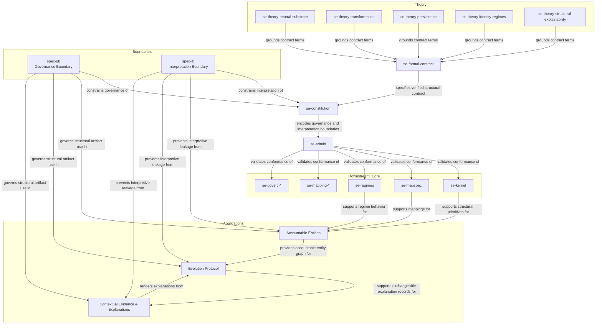

# Structural Explainability

> Defines neutral constraints under which explainability is possible without embedding interpretation.

## Overview

Some information systems make decisions that affect people, attribute claims to
sources, record contested facts, or coordinate across institutions that disagree.
When those systems collapse what should be distinct layers (what is structurally recorded, 
what is governed, what is interpreted, what is attested) into a single record,
they lose the ability to represent the disagreement they exist to handle.

That collapse is often invisible until the system is challenged:
in court, in audit, in appeal, in public review, or 
in cross-institutional reconciliation.
By then, the records may already have committed to interpretations,
authority claims, or judgments that the system never explicitly declared.

Structural Explainability defines the structural conditions under which this
collapse can be prevented.
It identifies what must be kept separate for an information system
to remain durable, inspectable, and contestable under persistent disagreement:

- identity from graph continuity
- attribution from authority
- governance status from correctness
- evidence from interpretation
- dependency from validity
- explanation from proof
- record from judgment

SE does not replace domain vocabularies, standards, ontologies, or existing data systems.
It constrains how systems implement them so that disagreement remains
visible, attributable, and useful over time.

## Accountable Record Systems

Structural Explainability defines constraints that information systems 
must satisfy to handle persistent disagreement without collapsing 
identity, structure, governance, interpretation, evidence, or explanation. 
The core SE repositories define those constraints. 
Accountable Record systems are user-facing applications that implement them.

The Accountable Record system repositories are in **active development**. 
They track main on their SE dependencies during this phase to allow the 
contract, implementations, and verification profiles to co-evolve. 
Pinned versions follow once the contract stabilizes.

The core SE repositories define substrate-level constraints.
Accountable Record systems are user-facing applications of those constraints:
they produce durable, inspectable records of decisions, relationships, claims,
dependencies, sources, interpretations, or processes in ways that support
inspection, contestation, audit, and continued use under disagreement.

These repositories are application-layer systems.
They are real systems, not demonstrations, 
built to use ordinary domain vocabularies while satisfying SE verification.

### Shared Contract

| Repository | Purpose |
|------------|---------|
| [accountable-record-spec](https://github.com/structural-explainability/accountable-record-spec) | Shared Accountable Record contract, export format, verification model, and cross-domain failure modes |

### Domain Systems

Real systems that implement the Accountable Record contract using ordinary domain vocabularies.

| Repository | Purpose |
|------------|---------|
| [judicial-record-spec](https://github.com/structural-explainability/judicial-record-spec) | Judicial record system for decisions, opinions, claims, holdings, citations, dependencies, later treatment, and source spans |
| [civic-influence-record-spec](https://github.com/structural-explainability/civic-influence-record-spec) | Civic influence record system for people, organizations, roles, funding, lobbying, affiliations, policy documents, and source-backed influence claims |

### Verification Profiles

SE verification implementations that check whether each domain system satisfies the Accountable Record contract.

| Repository | Purpose |
|------------|---------|
| [se-verification-judicial-record](https://github.com/structural-explainability/se-verification-judicial-record) | SE verification profile for judicial record systems |
| [se-verification-civic-influence-record](https://github.com/structural-explainability/se-verification-civic-influence-record) | SE verification profile for civic influence record systems |

SE Verification checks whether an Accountable Record system 
keeps certain distinctions intact:
between identity and graph continuity, 
between attribution and authority, 
between evidence and interpretation, 
between record and judgment. 
Systems that collapse these distinctions make it harder to represent disagreement accurately.

Structural Explainability does not replace domain ontologies or standards.
Domain systems may use Akoma Ntoso, LegalRuleML, FAIR principles, CIDOC-CRM, 
schema.org vocabularies, or any other appropriate standard. 
SE Verification checks whether a system's operational use of its 
chosen standard preserves the distinctions needed for 
accountable representation under persistent disagreement.

## Manifest Schema

All SE repositories include an SE Manifest describing the repo contents.

| Repository | Purpose |
|------------|---------|
| [se-manifest-schema](https://github.com/structural-explainability/se-manifest-schema) | Canonical `SE_MANIFEST.toml` schema; no upstream SE dependencies, consumed by all repos |

### Theory (Formal Derivation Layer)

These repositories contain evolving Lean 4 theorem development that
derives and justifies the formal contract.
They are not consumed directly by operational systems.

The transformation repository is the upstream vocabulary layer for describing
kinds of change independently of persistence or regime-specific survival claims.
The persistence repository defines identity persistence under admissible
transformation.

| Repository | Purpose |
|------------|--------|
| [se-theory-neutral-substrate](https://github.com/structural-explainability/se-theory-neutral-substrate) | Neutrality theorem development and defines admissible structure |
| [se-theory-transformation](https://github.com/structural-explainability/se-theory-transformation) | Defines change pressure and foundational transformation operators, families, composition relations, orthogonality relations, and outcome vocabulary |
| [se-theory-persistence](https://github.com/structural-explainability/se-theory-persistence) | Defines preservation, breakage, and irrelevance under admissible transformation |
| [se-theory-identity-regimes](https://github.com/structural-explainability/se-theory-identity-regimes) | Define regime-specific identity behavior, six-regime lower bound, and refinement to nine-regime profiles |
| [se-theory-structural-explainability](https://github.com/structural-explainability/se-theory-structural-explainability) | Explains the resulting judgment without collapsing disagreements |

Note: Each theory repo contains both 1) a TOML encoding and 2) a Lean proof encoding
of its core classification structures.
Before the theory layer can be considered complete,
every cell in every matrix must agree across both encodings,
and the theoretical justification for each cell value must be traceable to the SE papers.

The resolution process is:
identify a discrepancy between TOML and Lean counts,
isolate the cell,
formulate the question the discrepancy represents,
resolve it by appeal to relevant SE definitions,
update the wrong encoding, and confirm counts align.
See [Issue 1](https://github.com/structural-explainability/se-theory-identity-regimes/issues/1)
for a worked example.
A single disputed cell (REC x PV) where TOML and Lean assigned different verdicts,
the question that must be resolved to fix it,
and why resolution is part of the theory layer.

## Formal Contract and Operational Foundations

These repositories define the **neutral structural substrate** of Structural Explainability.
They define admissibility constraints under which identity regimes may be applied,
without encoding identity or persistence behavior themselves.
They establish the minimal, stable constraints under which identity, structure, change,
and explanation can coexist without embedding interpretation.

The formal contract layer provides machine-checked authorization of these constraints.
Operational foundation repositories consume this contract and enforce it.
They are authoritative and define what must be true for admissibility.
They do not contain domain semantics, applications, or analytics.

| Repository | Purpose |
|------------|--------|
| [se-formal-contract](https://github.com/structural-explainability/se-formal-contract) | Lean 4-verified formal contract exporting invariants, regimes, and constraints to operational layers |
| [se-constitution](https://github.com/structural-explainability/se-constitution) | Canonical schema, rules, and validation framework (consumes formal contract) |
| [se-admin](https://github.com/structural-explainability/se-admin) | Shared automation, scaffolding, and enforcement |
| [se-kernel](https://github.com/structural-explainability/se-kernel) | Core structural primitives and invariants (constrained by constitution and formal contract) |
| [se-mapspec](https://github.com/structural-explainability/se-mapspec) | Mapping vocabulary and cross-system semantics (constrained by formal contract relations) |

## Regime Execution

These repositories implement the executable identity and persistence regimes
over the neutral structural substrate.
They encode regime profiles, transformation families, and identity responses
(PRS / BRK / INH) as testable artifacts where:

- PRS = Preserves identity. The transformation does not change identity under the regime.
- BRK = Breaks identity. The transformation produces a distinct identity under the regime.
- INH = Inherits identity.
  The transformation does not act on the identity criteria tracked by the regime;
  identity is inherited from the prior state without regime-level evaluation.

These executables provide a stress-testing layer used to validate regime behavior
and to evaluate mappings under controlled transformations without introducing
causal or normative interpretation at the substrate level.
They do not introduce domain semantics and do not alter admissibility
constraints defined in the foundational repositories.

| Repository | Purpose |
|------------|---------|
| [se-regimes](https://github.com/structural-explainability/se-regimes) | Executable regime kernel (profiles, transformations, verdicts) |
| [se-regimes-pilot-education-math-g8](https://github.com/structural-explainability/se-regimes-pilot-education-math-g8) | Grade 8 mathematics regime pilot for linear equations and statistics |
| [se-regimes-explorer](https://github.com/structural-explainability/se-regimes-explorer) | SE Regimes Decision Tree |

## Mapping Examples

These repositories apply Structural Explainability mapping rules to bounded domain examples.

They are maintained in this organization only as **conformance examples**.
They are **not part of the neutral core** and do not extend or modify the substrate.
They demonstrate how mappings may be constructed across independent systems
while preserving neutrality and keeping interpretation external.

Applied source registries, dashboards, analytics, and public participation systems
belong in downstream organizations.

| Repository | Purpose |
|------------|---------|
| [se-mapping-education](https://github.com/structural-explainability/se-mapping-education) | Education standards mapping examples across jurisdictions and reference systems |
| [se-mapping-education-math](https://github.com/structural-explainability/se-mapping-education-math) | Mathematics standards mapping examples using central atomic competency units |
| [se-mapping-education-math-g8](https://github.com/structural-explainability/se-mapping-education-math-g8) | Grade 8 mathematics pilot mappings for linear equations and statistics |

## Source Materials (govsrc)

These repositories contain **traceable source materials** from governmental
or official public bodies.

They preserve source artifacts in a stable, inspectable form so that mappings,
profiles, and rules can reference them without copying, altering, or embedding
interpretation.

They do not define structure, identity, or behavior.
They do not introduce semantics beyond what is present in the source.

| Repository | Purpose |
|------------|---------|
| [se-govsrc-us](https://github.com/structural-explainability/se-govsrc-us) | All U.S. source materials |
| [se-govsrc-us-missouri](https://github.com/structural-explainability/se-govsrc-us-missouri) | Missouri-specific source materials |
| [se-govsrc-us-education](https://github.com/structural-explainability/se-govsrc-us-education) | U.S. education source materials |
| [se-govsrc-us-missouri-education](https://github.com/structural-explainability/se-govsrc-us-missouri-education) | Missouri education source materials |
| [se-govsrc-finland-education](https://github.com/structural-explainability/se-govsrc-finland-education) | Finland national curriculum source materials |
| [se-govsrc-norway-education](https://github.com/structural-explainability/se-govsrc-norway-education) | Norway curriculum (LK20) source materials |
| [se-govsrc-singapore-education](https://github.com/structural-explainability/se-govsrc-singapore-education) | Singapore syllabus source materials |
| [se-govsrc-oecd-pisa](https://github.com/structural-explainability/se-govsrc-oecd-pisa) | OECD PISA framework and assessment materials |

## Contract Derivation and Enforcement Chain

All repositories in this diagram declare an `SE_MANIFEST.toml` conforming to
[`se-manifest-schema`](https://github.com/structural-explainability/se-manifest-schema),
which has no upstream SE dependencies.

## Roles

This organization is structured around roles:

| Role                                                              | Purpose                                                             |
| ----------------------------------------------------------------- | ------------------------------------------------------------------- |
| [**Accountable Record Systems**](#accountable-record-systems)     | User-facing applications that implement and demonstrate the constraints |
| [**Specifications**](#normative-specifications)                   | Define what must be true for admissibility                          |
| [**Formalizations**](#formalizations)                             | Demonstrate that specifications are internally consistent           |
| [**Papers**](#papers)                                             | Justify why the constraints are necessary and unavoidable           |
| [**Boundaries & Overlays**](#boundary-and-overlay-specifications) | Define how interpretation may attach without entering the substrate |

## Specifications (Normative)

These repositories define the admissible representational space
for structurally explainable systems.
They are normative only in the sense of **defining structural constraints**, not interpretations.

### Structural Explainability (Foundation)

Defines neutrality and boundary constraints that apply to all downstream systems.

| Repository                                                      | Purpose                                                        | Status    |
| --------------------------------------------------------------- | -------------------------------------------------------------- | --------- |
| [spec-se](https://github.com/structural-explainability/spec-se) | Neutrality and boundary constraints for all downstream systems | Normative |

### Neutral Substrate (AE / EP)

These repositories define the core representational substrate
for structurally explainable systems.

| Repository                                                      | Purpose                                   | Status    |
| --------------------------------------------------------------- | ----------------------------------------- | --------- |
| [spec-ae](https://github.com/structural-explainability/spec-ae) | Accountable Entities and identity regimes | Normative |
| [spec-ep](https://github.com/structural-explainability/spec-ep) | Graph evolution over accountable entities | Normative |

### Interface (CEE)

The Contextual Evidence and Explanation (CEE) layer defines
a structural interface to the neutral substrate.
It does not alter identity, structure, or recorded change.

| Repository                                                        | Purpose                                                       | Status    |
| ----------------------------------------------------------------- | ------------------------------------------------------------- | --------- |
| [spec-cee](https://github.com/structural-explainability/spec-cee) | Contextual evidence, explanation, attestation, and provenance | Normative |

### Boundaries (GB / IB)

These repositories define additional structural boundaries
that operate relative to the neutral substrate.
They do not alter identity, structure, or recorded change.
They serve as guardrails that prevent interpretation from leaking into the neutral substrate.

| Repository                                                        | Purpose                                                       | Status    |
| ----------------------------------------------------------------- | ------------------------------------------------------------- | --------- |
| [spec-gb](https://github.com/structural-explainability/spec-gb)   | Governance boundary for structural artifacts and actions      | Normative |
| [spec-ib](https://github.com/structural-explainability/spec-ib)   | Interpretation boundary for external frameworks               | Normative |

### Informative

| Repository                                                                        | Purpose                                             | Status      |
| --------------------------------------------------------------------------------- | --------------------------------------------------- | ----------- |
| [spec-se-appendix](https://github.com/structural-explainability/spec-se-appendix) | Identifier rules, examples, and cross-spec patterns | Informative |

## Formalizations

These repositories **do not define meaning or behavior**.
They demonstrate that the specifications are internally consistent,
coherent, and composable under formal reasoning.

### Original / Outdated Foundations

> ⚠️ The repositories below are archived. Active development has moved to
> the `se-theory-*` series.

| Repository                                                                                        | Purpose                     | CI                                                                                                                          | Description                           |
| ------------------------------------------------------------------------------------------------- | --------------------------- | --------------------------------------------------------------------------------------------------------------------------- | ------------------------------------- |
| [StructuralExplainability](https://github.com/structural-explainability/StructuralExplainability) | Cross-cutting constraints   |  | Neutrality and conformance predicates |
| [NeutralSubstrate](https://github.com/structural-explainability/NeutralSubstrate) | Neutrality theorem |  | Substrates stable under incompatible extensions must be pre-causal and pre-normative                                                  |
| [IdentityRegimes](https://github.com/structural-explainability/IdentityRegimes)   | Identity regimes   |   | Six identity-and-persistence regime (families) are necessary and sufficient for accountability-oriented substrates under neutrality assumptions |

### Neutral Substrate (AE / EP)

These repositories formalize the neutral substrate defined by AE and EP.

| Repository                                                                                        | Purpose                     | CI                                                                                                                          | Description                           |
| ------------------------------------------------------------------------------------------------- | --------------------------- | --------------------------------------------------------------------------------------------------------------------------- | ------------------------------------- |
| [AccountableEntities](https://github.com/structural-explainability/AccountableEntities)           | Entity-regime instantiation |       | Formalization of AE identity regimes  |
| [EvolutionProtocol](https://github.com/structural-explainability/EvolutionProtocol)               | Neutral exchange substrate  |         | Formalization of EP graph evolution   |

### Interface (CEE)

This repository formalizes **the structural interface layer**
over the neutral substrate.

| Repository                                                                                    | Purpose                 | CI                                                                                                                        | Description                                                                |
| --------------------------------------------------------------------------------------------- | ----------------------- | ------------------------------------------------------------------------------------------------------------------------- | -------------------------------------------------------------------------- |
| [CEE](https://github.com/structural-explainability/CEE)                                       | Explanation overlay     |                     | Structural forms for contextual explanation and evidence                   |

### Boundaries (GB / IB)

These repositories formalize **additional structural boundaries**
that operate relative to the neutral substrate.
They keep interpretation from leaking into the neutral substrate.

| Repository                                                                                    | Purpose                 | CI                                                                                                                        | Description                                                                |
| --------------------------------------------------------------------------------------------- | ----------------------- | ------------------------------------------------------------------------------------------------------------------------- | -------------------------------------------------------------------------- |
| [GovernanceBoundary](https://github.com/structural-explainability/GovernanceBoundary)         | Governance boundary     |      | Governance                                                                 |
| [InterpretationBoundary](https://github.com/structural-explainability/InterpretationBoundary) | Interpretation boundary |  | Conditions under which external frameworks may interpret substrate records |

## Papers

Structural Explainability consists of a small formal core (SE-100: Neutrality; SE-200: Identity Regimes)
and a parallel stewardship track (SE-ST-Gx) addressing governance over time.
The stewardship track examines how neutral systems are defined, audited, stressed, and repaired in real institutional contexts.

The two formal papers provide theoretical justification for foundational specifications.
They are explanatory rather than normative (they describe what must be true for such systems to work, not what people should believe or do).

Stewardship papers build on the formal core but do not modify or extend it.

| Repository                                                                                              | Focus              | Status    | Description                                                                                                                                  |
| ------------------------------------------------------------------------------------------------------- | ------------------ | --------- | -------------------------------------------------------------------------------------------------------------------------------------------- |
| [paper-100-neutral-substrate](https://github.com/structural-explainability/paper-100-neutral-substrate) | Neutrality theorem | Submitted | Narrative exposition of the neutrality theorem and its formal proof, establishing design constraints for neutral representational substrates |
| [paper-200-identity-regimes](https://github.com/structural-explainability/paper-200-identity-regimes)   | Identity regimes   | Submitted | Narrative exposition of the identity-regimes result and its formal justification                                                             |

### General Descriptions

 - [Neutrality](https://arxiv.org/abs/2601.14271): If you want to build an information system for domains
   where people legitimately disagree (like law or politics),
   the core of the system must be neutral;
   if you bake in causes, values, or conclusions,
   the system cannot represent disagreement accurately.

- [Identity Regimes](https://arxiv.org/abs/2601.16152): To represent identity
  and persistence under structural change, information must distinguish between
  regime-relative ways that entities persist, break, or become irrelevant under
  transformation. The current framework organizes this through six regime
  families refined into nine profile kinds.

## Design Commitments

Across all repositories:

- Identity and persistence are profile-relative.
- Structure and change are recorded without interpretation.
- Transformation does not by itself determine persistence.
- Graph continuity does not by itself imply identity continuity.
- Interpretation remains external, attributable, and contestable.
- Governance records do not imply authority, legitimacy, obligation, or enforcement.
- Disagreement is representable and not forced to resolve.
- No domain semantics are embedded in the core.
- Verification is optional; systems may be useful in their domain
  without being SE-verified, and may seek verification as a quality property.

## Intentionally Excluded

The following are intentionally excluded from this core organization:

- domain vocabularies (except clearly labeled examples and Accountable Record systems)
- application schemas or data models (except in Accountable Record systems)
- analytics, inference, optimization, recommendation, or decision systems
- governance authority, legitimacy, obligation, or enforcement frameworks
- interpretation, explanation, evidence, or attestation as substrate facts
- visualization or presentation layers

Domain projects may claim conformance with these specifications, but are outside this core.

## How to Use This Organization

- **To understand the justification**, start with the papers.
- **To understand the architecture**, start with the specifications.
- **To verify formal coherence**, consult the Lean formalizations.
- **To consume stable definitions**, use the formal contract artifacts.
- **To validate repositories**, use the manifest and conformance tooling.

## Core Statement

Structural Explainability defines a neutral structural substrate for recording
identity, structure, transformation, and change without embedding interpretation,
authority, causality, or judgment.

At its core, Structural Explainability is concerned with identity and persistence.
Stable, inspectable identity is a precondition for explanation, provenance,
mapping, and disagreement over time. Identity and persistence are profile-relative:
the same structural change may preserve identity under one profile, break identity
under another, and be irrelevant under another.

Structural Explainability does not claim to remove interpretation. It separates
structural commitments from interpretive, causal, epistemic, normative, and
governance commitments so that disagreement can remain explicit, attributable,
and contestable.

Within the core substrate, structure, transformation, persistence, and profile
behavior may be recorded. Interpretation, explanation, evidence, authority,
legitimacy, obligation, and enforcement remain outside the substrate unless
attached through explicitly constrained downstream mechanisms.

- **Neutral substrate** defines admissible structural description without
  interpretive commitment.
- **Transformation theory** defines structural change pressures.
- **Persistence theory** defines profile-relative preservation, breakage, and
  irrelevance under transformation.
- **Identity regimes** define six regime families refined into nine profile kinds.
- **Structural Explainability** integrates these layers into an explainable
  structural account without collapsing disagreement.

Two boundary specifications protect this separation:

- **Governance Boundary (GB)** prevents governance records from becoming claims
  of authority, legitimacy, obligation, or enforcement.
- **Interpretation Boundary (IB)** prevents interpretive attachments from
  becoming substrate semantics.

Downstream specifications then use the core without redefining it:

- **Accountable Entities (AE)** defines accountability-facing entity kinds as a
  controlled projection of the nine SE profile kinds.
- **Evolution Protocol (EP)** defines accountable-entity graph states, deltas,
  and histories as they move through time, without deriving identity persistence
  from graph continuity alone.
- **Contextual Evidence & Explanations (CEE)** defines an interpretation overlay
  for context tags, explanations, evidence references, attestations, and
  provenance without modifying substrate records.

Interpretation does not disappear. It is made explicit, attributable, external,
and contestable.

Structural Explainability is not anti-interpretation; it is anti-implicit
interpretation. Interpretive artifacts may exist only in forms that do not alter
identity, structure, transformation, persistence, or recorded change.

Structural Explainability is designed for plural systems: independent
implementations that represent related phenomena without requiring one shared
ontology, uniform naming, or centralized authority. Differences are addressed
through explicit mappings and boundary-respecting attachments rather than forced
normalization or consensus.

Domains such as science, model development, education, and law do not alter the
substrate. They may contribute controlled vocabularies, examples, mappings, and
contextual explanations, but those additions remain external to the neutral core
and do not assert truth, causality, authority, legitimacy, obligation, or
enforcement as substrate facts.

The result is a system that records structural commitments without deciding
their ultimate meaning, enables explanation without enforcing agreement, and
supports long-term coordination across disagreement, institutional change, and
time.
