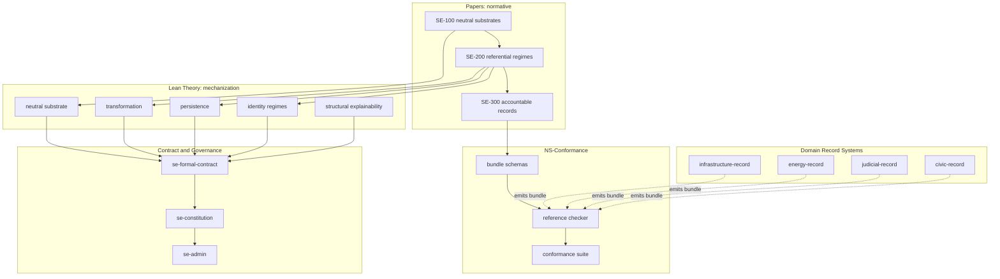

# Structural Explainability

<!-- markdownlint-disable MD024 -->

> Defines the neutral constraints under which systems remain explainable,
> inspectable, and contestable without embedding interpretation.

## Core Statement

Structural Explainability (SE) defines a neutral structural substrate for recording
identity, structure, transformation, and change without embedding interpretation,
authority, causality, or judgment.

Structural Explainability is not anti-interpretation; it is anti-implicit interpretation.
It separates structural facts from downstream claims so interpretation and
disagreement can remain explicit, attributable, and contestable over time.

Every record system commits to identity semantics.
When a rule is refined, an agent redeployed, a jurisdiction subdivided,
or two records merged, the system decides whether the thing is still the same thing.
That decision is load-bearing for citation, liability, and audit.
It not always declared.

SE makes the commitment declarable, and makes the failure detectable.

### The Foundational Core

- **Identity & Persistence:** A stable, inspectable identity is the prerequisite
  for all tracking and provenance. Identity is _regime-relative_:
  a single structural change might preserve identity under one regime,
  break it under another, or be identity-neutral under a third.
- **Declared Identity Semantics:** A system that branches on an undeclared field to
  decide sameness is running a _hidden regime_.
  SE exists to detect hidden regimes.
- **Plural Systems:** SE is built for independent architectures
  that share data without requiring a centralized authority,
  uniform naming, or a single forced ontology.

### The Architecture Stack

| Layer                         | Function                                                                                                                                                             |
| :---------------------------- | :------------------------------------------------------------------------------------------------------------------------------------------------------------------- |
| **Neutral Substrate**         | Defines admissible structural description without interpretive commitment.                                                                                           |
| **Transformation Theory**     | Identifies and defines structural change pressures.                                                                                                                  |
| **Persistence Theory**        | Classifies each transformation, relative to an identity regime, as identity-preserving (PRS), identity-breaking (BRK), identity-neutral (NEU), or inapplicable (NA). |
| **Identity Regimes**          | Organizes identity and persistence behavior into nine core identity regimes.                                                                                         |
| **Structural Explainability** | Integrates these layers into an explicit, explainable account without forcing consensus.                                                                             |
| **Structural Explainability** | Integrates these layers into an explicit, explainable account without forcing consensus.                                                                             |
| **NS-Conformance**            | Decides, over a declared artifact, whether a deployed record system satisfies the substrate constraint.                                                              |

Within the core substrate, structure, transformation, persistence, and regime
behavior may be recorded.
Causal explanation, normative evaluation, authority,
legitimacy, obligation, and enforcement are not asserted as substrate-level commitments;
they may be attached through constrained downstream mechanisms.

### Protected Boundaries

Two strict architectural boundaries protect this substrate
from leaking or collapsing into downstream application layers:

- _Governance Boundary (GB):_ Prevents operational records from implicitly
  transforming into claims of absolute authority, legitimacy, obligation, or enforcement.
- _Interpretation Boundary (IB):_ Ensures that external frameworks, explanations, and model interpretations
  remain attached as dynamic overlays rather than becoming hardcoded substrate semantics.
- _Attribution Boundary (REF / ATTR / EXT):_ Classifies exposed paths of a deployed
  record by the foundational commitment it carries: referential, attributive, or extension.
  This boundary is decidable and checked.

Downstream domains (e.g., law, infrastructure, agentic AI systems)
consume the core substrate without redefining it.
SE records the structural commitments of a system without deciding their ultimate meaning,
enabling continuous cross-institutional coordination through persistent disagreement.

## Overview

Some information systems make decisions that affect people, attribute claims to
sources, record contested facts, or coordinate across institutions that disagree.
Those systems can hold a compliance conclusion, a legal holding, or a causal claim
while every party continues to refer to the same underlying artifacts.

They fail in a specific way.
Under change, the system must decide what stays the same:
whether a refined rule is the same rule,
whether a redeployed agent is the same agent,
whether a subdivided scope is the same scope.
The system decides. It decides by branching on some field,
such as a version column, status flag,
or display attribute not necessarily declared as identity-relevant.

That is a _hidden regime_:
identity semantics implemented but not declared,
which may remain invisible until the system is challenged
in court, in audit, in appeal, in public review, or
in cross-institutional reconciliation.
By then, the records may already have committed to an identity model
not explicitly declared.

Existing infrastructure may not catch it.
Provenance models, content credentials, software bills of materials,
version control, and audit logs record what happened.
None answer what the system takes sameness to be, and cannot detect a
system that answers it differently in undeclared fields.

Structural Explainability defines the structural conditions under which this
can be prevented, and gives a decision procedure for checking.
A conforming system declares its carrier kinds, identity bases, identity regimes,
transformation histories, attribution boundaries, and discriminator surfaces.
A checker decides conformance over those declarations and returns finite witnesses when it fails.

SE does not replace domain vocabularies, standards, ontologies, or existing data systems.
It constrains how systems implement them so that disagreement remains
visible, attributable, and useful over time.

View the Neutral Record Methodology Approach

### The Neutral Record Approach

In information science, creating a **neutral record** means developing a
data schema, ontology, or knowledge graph that intentionally avoids
embedding specific subjective, cultural, or institutional norms into its core structure.

Traditional schemas often reflect the worldview of their creators.
This can make them rigid and bias data collection against different paradigms.

This research field aims to separate data syntax and structure from data semantics and interpretation.
The goal is to build highly flexible, semantic architectures,
via decentralized ledgers or modular metadata schemas,
where data can be ingested exactly as it exists or is reported.
The interpretations, values, and norms are then applied via dynamic overlays
or flexible querying layers, and are not hardcoded into the foundational ontology itself.

By separating the neutral substrate (what structurally happened)
from the interpretation boundary (claims made),
SE addresses a significant challenge in information ecosystems.

## Papers

The formal core of Structural Explainability is developed in three papers.
The papers are the normative specification.

| Paper      | Title                                                                                                 | arXiv                                          |
| ---------- | ----------------------------------------------------------------------------------------------------- | ---------------------------------------------- |
| **SE-100** | Neutral Substrates: A Design Constraint for Shared Records Under Persistent Interpretive Disagreement | [2601.14271](https://arxiv.org/abs/2601.14271) |
| **SE-200** | Referential Regimes: Transformation-Invariant Identity for Neutral Substrates                         | [2601.16152](https://arxiv.org/abs/2601.16152) |
| **SE-300** | Accountable Records: NS-Conformance Checking for Transformation-Invariant Identity                    | _in preparation_                               |

**SE-100** establishes the neutrality-by-design constraint:
a substrate is neutral when its foundational layer is restricted
to referential commitments and permitted attribution propositions.

**SE-200** derives the referential-regime structure that neutral substrates require,
yielding six coarse families and nine core identity regimes:
OBL, OCC, REC, LOC, OBJ, SCOPE-E, SCOPE-S, RULE-C, RULE-S.

**SE-300** defines the _accountable record_,
the deployed artifact that declares its carrier, basis, regime,
transformation history, attribution boundary, and discriminator surfaces,
and provides checks that decide NS-conformance over it.

Conformance is three-valued:
PASS, FAIL, or INDETERMINATE.
An indeterminate result does not count as conformance.
Failures return finite witnesses, not scores.

Full conformance is disclosure-relative:
the checker decides over the declared artifact,
and a later undeclared-surface witness refutes the claim.

A parallel stewardship track addresses governance over time covering how neutral systems are
defined, audited, stressed, and repaired in real institutional contexts.

| Repository                                                                                                  | Focus               |
| ----------------------------------------------------------------------------------------------------------- | ------------------- |
| [paper-100-neutral-substrate](https://github.com/structural-explainability/paper-100-neutral-substrate)     | Neutral substrates  |
| [paper-200-identity-regimes](https://github.com/structural-explainability/paper-200-identity-regimes)       | Referential regimes |
| [paper-300-accountable-records](https://github.com/structural-explainability/paper-300-accountable-records) | Accountable records |

## NS-Conformance

NS-conformance is the checkable relation defined by SE-300. This is the layer at which
the theory meets a deployed system.

| Repository                                                                    | Purpose                                                                                                                                     |
| ----------------------------------------------------------------------------- | ------------------------------------------------------------------------------------------------------------------------------------------- |
| [ns-conformance](https://github.com/structural-explainability/ns-conformance) | Machine-readable schemas for the accountable-record bundle, the reference checker for the NS-conformance checks, and the conformance suite. |

An **accountable-record bundle** supplies the following artifacts:

1. a carrier-basis-regime profile;
2. record identifiers and payload references;
3. typed transformation histories;
4. attribution-boundary declarations;
5. a discriminator-surface registry; and
6. a disclosure attestation identifying the implementation boundary.

The **checker** consumes a bundle and returns a conformance report:
per-record and per-store results, the effective declarations used by each check,
normalized histories, and every failure and indeterminate witness.

The **conformance suite** is a set of bundles with known verdicts
sufficient to validate an independent implementation of the checks.
It allows checkers to be tested and falsified.

Bundles may be produced directly, or emitted by adapters over existing provenance graphs,
version-control systems, schema registries, workflow engines, and audit logs.
Adapters are not part of the specification.

## Repository Manifests

SE repositories use manifests to describe the repository's role, scope, dependencies,
provided artifacts, validation expectations, governance, and traceability.

The SE manifest complements external metadata standards.
Citation metadata belongs in `CITATION.cff`;
software supply-chain metadata may use SPDX;
software discovery metadata may use CodeMeta;
research-object packaging may use RO-Crate.

| Repository                                                                            | Purpose                                        |
| ------------------------------------------------------------------------------------- | ---------------------------------------------- |
| [se-manifest-schema](https://github.com/structural-explainability/se-manifest-schema) | Canonical manifest schema for SE repositories. |

## Operational Security: Capability vs. Authority

Before looking at the tooling implementations,
it is critical to see how SE's non-collapse discipline applies to the development environment itself.
Just as the data substrate must not collapse history into interpretation,
the operational environment must not collapse technical permissions into semantic authority.

## Capability Is Not Authority

> A protected surface is one where the technical capability to change it
> is not the authority to change it.

Access control can grant the capability to perform an operation.
It does not by itself establish that the capability is sufficient authority
to modify a protected repository or lifecycle surface.

Accountable Surfaces records where capability is insufficient authority,
and binds each crossing of that gap to required human review, supporting evidence,
and permitted AI participation.

The authority manifest is self-protecting because the alternative is the
collapse it exists to prevent: if an actor with technical capability can rewrite
the authority declaration, capability has silently become authority.

## Repository Authority Surfaces

SE repositories may additionally declare an authority manifest at
`.accountability/surfaces.toml`, a sibling to `SE_MANIFEST.toml`.

Where `SE_MANIFEST.toml` declares structural role, scope, and dependencies,
the authority manifest declares which repository and lifecycle surfaces are
authority-bearing: surfaces a tool may be technically able to change but is
not legitimately authorized to change without review.

This layer is operational, not substrate.
It records declared review and evidence requirements for repository surfaces.
It does not confer authority, legitimacy, obligation, or enforcement as substrate facts,
and it respects the Governance Boundary.
Enforcement is external and lives with `se-admin` tooling.

It applies SE's non-collapse discipline to the authority layer:
technical capability is separated from legitimate authority,
as record is separated from judgment.
AI systems may assist review but may not satisfy human review authority.

The authority manifest is itself a protected surface.
It requires human review and evidence of review,
and AI authority over it is prohibited.

| Repository                                                                                                        | Purpose                                                                                                |
| ----------------------------------------------------------------------------------------------------------------- | ------------------------------------------------------------------------------------------------------ |
| [accountable-surface-spec](https://github.com/structural-explainability/accountable-surface-spec)                 | Source of truth for `.accountability/surfaces.toml` structure                                          |
| [accountable-authority-vocabulary](https://github.com/structural-explainability/accountable-authority-vocabulary) | Permission, AI authority level, and revocation terms                                                   |
| [accountable-surface-vocabulary](https://github.com/structural-explainability/accountable-surface-vocabulary)     | Surface object, role, lifecycle gate, downstream effect                                                |
| [accountable-evidence-vocabulary](https://github.com/structural-explainability/accountable-evidence-vocabulary)   | Evidence and verification terms                                                                        |
| [accountable-review-vocabulary](https://github.com/structural-explainability/accountable-review-vocabulary)       | Review, review scope, and reviewer authority terms                                                     |
| [se-codeowners](https://github.com/structural-explainability/se-codeowners)                                       | CLI utility that projects accountable surface declarations into GitHub CODEOWNERS and checks for drift |

The project `se-codeowners` is an enforcement projection,
not the source of authority.
The authority declaration remains `.accountability/surfaces.toml`;
`se-codeowners` renders one GitHub-specific expression of that declaration
by mapping oversight roles to CODEOWNERS entries.
This supports ordinary repository governance without collapsing
technical write capability into legitimate review authority.

## Accountable Agents

Accountable Agents extends the same non-collapse discipline to agentic AI systems.

An agent system may have technical capability:
it may observe, interpret, propose, modify, execute, transmit,
or self-alter depending on its product wrapper, execution environment,
tools, and permissions.
Some systems may also be configured near approval surfaces,
such as merge, release, deployment, certification, or risk acceptance.

That capability is not authority.
Responsibility cannot rest with an agent system; agent systems are tools.
Authority and accountability remain with the people and institutions
that use, build, release, deploy, authorize, operate, and review the systems.

This work is data-focused.
It works alongside existing standards, security guidance,
provenance models, model cards, product documentation, and research.
It links them through claim-level records so that agent capabilities,
affected surfaces, evidence sources, risk mappings, and
accountability requirements can be inspected together.

| Repository                                                                                          | Purpose                                                                                                                                                                             |
| --------------------------------------------------------------------------------------------------- | ----------------------------------------------------------------------------------------------------------------------------------------------------------------------------------- |
| [accountable-agents](https://github.com/structural-explainability/accountable-agents)               | Conceptual model for accountable agent systems, capabilities, execution environments, authority grants, evidence, review gates, protected surfaces, and accountable entities.       |
| [agent-capability-registry](https://github.com/structural-explainability/agent-capability-registry) | Reusable vocabulary for capability kinds, observable resources, effectable resources, capability levels, evidence statuses, mapping kinds, risks, mitigations, and standards links. |
| [agent-capability-mappings](https://github.com/structural-explainability/agent-capability-mappings) | Source-linked claims mapping specific products, models, versions, modes, execution environments, tools, and permissions to documented or inferred capabilities.                     |

## Shared Contract Tooling

Shared contract tooling supports packaging, validation, and distribution of
machine-readable contract artifacts across SE repositories.

| Repository                                                                      | Purpose                                                                                  |
| ------------------------------------------------------------------------------- | ---------------------------------------------------------------------------------------- |
| [se-contract-kit](https://github.com/structural-explainability/se-contract-kit) | Shared Python tooling for packaging, validating, and distributing SE contract artifacts. |

### Domain Record Systems

Domain record systems apply SE constraints to durable records in a specific domain,
using ordinary domain vocabularies. A domain record system is a candidate producer of
accountable-record bundles; whether it produces conformant ones is decided by the checker.

SE does not replace domain ontologies or standards. Domain systems may use
[Akoma Ntoso](https://www.oasis-open.org/standard/akn-v1-0/),
[LegalRuleML](https://docs.oasis-open.org/legalruleml/legalruleml-core-spec/v1.0/legalruleml-core-spec-v1.0.html),
[other OASIS open standards](https://www.oasis-open.org/standards/),
[FAIR principles](https://www.nature.com/articles/sdata201618),
[CIDOC-CRM](https://cidoc-crm.org/),
[schema.org](https://schema.org/) vocabularies, or other domain standards.
NS-conformance checks whether a system's use of its chosen standards declares its identity
semantics and keeps them consistent. It does not decide truth, legal correctness, civic
authority, institutional legitimacy, or final domain meaning.

| Repository                                                                                  | Purpose                                                                                                                                                                                              |
| ------------------------------------------------------------------------------------------- | ---------------------------------------------------------------------------------------------------------------------------------------------------------------------------------------------------- |
| [infrastructure-record](https://github.com/structural-explainability/infrastructure-record) | General infrastructure record system for assets, facilities, networks, inspections, dependencies, maintenance, incidents, operational state, source observations, and infrastructure record reports. |
| [energy-record](https://github.com/structural-explainability/energy-record)                 | General energy record system for generation, storage, hydrogen, transmission, distribution, interconnection, outage, reliability, emissions, dependencies, model outputs, and energy record reports. |
| [judicial-record](https://github.com/structural-explainability/judicial-record)             | General judicial record system for decisions, opinions, claims, holdings, citations, dependencies, later treatment, procedural history, source spans, and judicial record reports.                   |
| [civic-record](https://github.com/structural-explainability/civic-record)                   | General civic record system for people, organizations, roles, meetings, documents, relationships, funding, actions, sources, decisions, and civic records.                                           |

View Sector Mappings & Custom Extensions (Infrastructure, Civic, Education)

#### Extended Asset Implementations

- **General Infrastructure Records:** Shared definitions covering physical locations,
  routing linkages, systemic states, and operations.
- **Sector-Specific Specializations:** Extends downstream objects to `water-record`,
  `telecommunications-record`, `transportation-record`, and `waste-record` layouts.
- **Digital-Twin Linking:** Maps physical operational telemetry streams
  directly to logical models and underlying assumptions.

#### Jurisdiction Specialization Modules

- [judicial-record-us-federal-supreme](https://github.com/structural-explainability/judicial-record-us-federal-supreme) -
  Dedicated target data logic patterns optimized for US Supreme Court
  dockets, briefs, citations, and structured procedural records.

#### Local Public Domain Architectures

- `municipal-record` - budget definitions, ordinances, and council tracking paths.
- `municipal-contract-record` - public procurement validation loops from bids to performance.
- `public-meeting-record` - verifiable trace layouts for voting outcomes and agendas.
- `public-budget-record` - tracing fund appropriations without collapsing authority structures.

#### Academic Schema Extensions

- `education-record` - handles multi-jurisdictional criteria frameworks,
  competency matrices, tracking standards alignment histories, and
  systemic adoptions without merging disparate semantic interpretations.

## Mathematical Foundations & Proof Chains

View Category Theory Math, Lean 4 Theorems, and Specifications

### Theory (Formal Derivation Layer)

These repositories contain evolving Lean 4 theorem development
that derives and justifies the formal contract.
They are not consumed directly by operational systems.

| Repository                                                                                                              | Purpose                                                                                                                                             |
| ----------------------------------------------------------------------------------------------------------------------- | --------------------------------------------------------------------------------------------------------------------------------------------------- |
| [se-theory-reference-kit](https://github.com/structural-explainability/se-theory-reference-kit)                         | Shared Python tooling for scaffolding, validating, inspecting, and exporting theory-reference artifacts that mirror Lean public surfaces            |
| [se-theory-neutral-substrate](https://github.com/structural-explainability/se-theory-neutral-substrate)                 | Formal development of the neutral-substrate constraint and admissible structure                                                                     |
| [se-theory-transformation](https://github.com/structural-explainability/se-theory-transformation)                       | Defines change pressure and foundational transformation operators, families, composition relations, orthogonality relations, and outcome vocabulary |
| [se-theory-persistence](https://github.com/structural-explainability/se-theory-persistence)                             | Defines preservation, breakage, and irrelevance under admissible transformation                                                                     |
| [se-theory-identity-regimes](https://github.com/structural-explainability/se-theory-identity-regimes)                   | Defines regime-specific identity and persistence behavior using nine core identity regimes                                                          |
| [se-theory-structural-explainability](https://github.com/structural-explainability/se-theory-structural-explainability) | Explains the resulting judgment without collapsing disagreements                                                                                    |

### Formal Contract and Operational Foundations

| Repository                                                                            | Purpose                                                                                              |
| ------------------------------------------------------------------------------------- | ---------------------------------------------------------------------------------------------------- |
| [se-formal-contract](https://github.com/structural-explainability/se-formal-contract) | Lean 4-verified formal contract exporting invariants, regimes, and constraints to operational layers |
| [se-constitution](https://github.com/structural-explainability/se-constitution)       | Canonical schema, rules, and validation framework (consumes formal contract)                         |
| [se-admin](https://github.com/structural-explainability/se-admin)                     | Shared automation, scaffolding, and enforcement                                                      |
| [se-kernel](https://github.com/structural-explainability/se-kernel)                   | Core structural primitives and invariants (constrained by constitution and formal contract)          |
| [se-mapspec](https://github.com/structural-explainability/se-mapspec)                 | Mapping vocabulary and cross-system semantics (constrained by formal contract relations)             |

### Regime Execution

| Repository                                                                                                            | Purpose                                                              |
| --------------------------------------------------------------------------------------------------------------------- | -------------------------------------------------------------------- |
| [se-regimes](https://github.com/structural-explainability/se-regimes)                                                 | Executable regime kernel (regimes, transformations, verdicts)        |
| [se-regimes-pilot-education-math-g8](https://github.com/structural-explainability/se-regimes-pilot-education-math-g8) | Grade 8 mathematics regime pilot for linear equations and statistics |
| [se-regimes-explorer](https://github.com/structural-explainability/se-regimes-explorer)                               | SE Regimes Decision Tree                                             |

### Mapping Examples

| Repository                                                                                                | Purpose                                                                         |
| --------------------------------------------------------------------------------------------------------- | ------------------------------------------------------------------------------- |
| [se-mapping-education](https://github.com/structural-explainability/se-mapping-education)                 | Education standards mapping examples across jurisdictions and reference systems |
| [se-mapping-education-math](https://github.com/structural-explainability/se-mapping-education-math)       | Mathematics standards mapping examples using central atomic competency units    |
| [se-mapping-education-math-g8](https://github.com/structural-explainability/se-mapping-education-math-g8) | Grade 8 mathematics pilot mappings for linear equations and statistics          |

### Source Materials (govsrc)

| Repository                                                                                                      | Purpose                                      |
| --------------------------------------------------------------------------------------------------------------- | -------------------------------------------- |
| [se-govsrc-us](https://github.com/structural-explainability/se-govsrc-us)                                       | All U.S. source materials                    |
| [se-govsrc-us-missouri](https://github.com/structural-explainability/se-govsrc-us-missouri)                     | Missouri-specific source materials           |
| [se-govsrc-us-education](https://github.com/structural-explainability/se-govsrc-us-education)                   | U.S. education source materials              |
| [se-govsrc-us-missouri-education](https://github.com/structural-explainability/se-govsrc-us-missouri-education) | Missouri education source materials          |
| [se-govsrc-finland-education](https://github.com/structural-explainability/se-govsrc-finland-education)         | Finland national curriculum source materials |
| [se-govsrc-norway-education](https://github.com/structural-explainability/se-govsrc-norway-education)           | Norway curriculum (LK20) source materials    |
| [se-govsrc-singapore-education](https://github.com/structural-explainability/se-govsrc-singapore-education)     | Singapore syllabus source materials          |
| [se-govsrc-oecd-pisa](https://github.com/structural-explainability/se-govsrc-oecd-pisa)                         | OECD PISA framework and assessment materials |

### Normative and Informative Specifications

| Repository                                                                        | Purpose                                                         | Status      |
| --------------------------------------------------------------------------------- | --------------------------------------------------------------- | ----------- |
| [spec-se](https://github.com/structural-explainability/spec-se)                   | Neutrality and boundary constraints for all downstream systems  | Normative   |
| [spec-ae](https://github.com/structural-explainability/spec-ae)                   | Accountable entity kinds; references canonical identity regimes | Normative   |
| [spec-ep](https://github.com/structural-explainability/spec-ep)                   | Graph evolution over accountable entities                       | Normative   |
| [spec-cee](https://github.com/structural-explainability/spec-cee)                 | Contextual evidence, explanation, attestation, and provenance   | Normative   |
| [spec-gb](https://github.com/structural-explainability/spec-gb)                   | Governance boundary for structural artifacts and actions        | Normative   |
| [spec-ib](https://github.com/structural-explainability/spec-ib)                   | Interpretation boundary for external frameworks                 | Normative   |
| [spec-se-appendix](https://github.com/structural-explainability/spec-se-appendix) | Identifier rules, examples, and cross-spec patterns             | Informative |

### Optional Reference Implementations and Formal Anchors

| Repository                                                                                    | Purpose                       | Description                                                                               |
| --------------------------------------------------------------------------------------------- | ----------------------------- | ----------------------------------------------------------------------------------------- |
| [AccountableEntities](https://github.com/structural-explainability/AccountableEntities)       | Accountable entity kinds      | Lean formalization of six AE entity kinds and their mapping to canonical identity regimes |
| [EvolutionProtocol](https://github.com/structural-explainability/EvolutionProtocol)           | Graph evolution over entities | Formalization of EP graph evolution                                                       |
| [CEE](https://github.com/structural-explainability/CEE)                                       | Evidence interface            | Structural forms for contextual explanation, evidence, attestation, and provenance        |
| [GovernanceBoundary](https://github.com/structural-explainability/GovernanceBoundary)         | Governance boundary           | Structural boundary for governance artifacts and actions                                  |
| [InterpretationBoundary](https://github.com/structural-explainability/InterpretationBoundary) | Interpretation boundary       | Conditions under which external frameworks may interpret substrate records                |

### Archived / Superseded Theory Repositories

| Repository                                                                                        | Purpose                      | Description                                                                                                                     |
| ------------------------------------------------------------------------------------------------- | ---------------------------- | ------------------------------------------------------------------------------------------------------------------------------- |
| [StructuralExplainability](https://github.com/structural-explainability/StructuralExplainability) | Cross-cutting constraints    | Neutrality and conformance predicates                                                                                           |
| [NeutralSubstrate](https://github.com/structural-explainability/NeutralSubstrate)                 | Neutral-substrate constraint | Earlier formalization of the constraint that substrate-level commitments exclude object-level causal and normative propositions |
| [IdentityRegimes](https://github.com/structural-explainability/IdentityRegimes)                   | Referential regimes          | Earlier formalization of identity-and-persistence regime families prior to the current nine-regime refinement                   |

## Derivation Chain

The papers define the theory. The Lean development mechanizes it. The checker decides it.

All repositories in this diagram declare an `SE_MANIFEST.toml` conforming to
[`se-manifest-schema`](https://github.com/structural-explainability/se-manifest-schema),
which has no upstream SE dependencies.

## How to Use This Organization

- **To understand the theory**, read the papers. They are the specification.
- **To check a record system**, use `ns-conformance`: schemas, checker, conformance suite.
- **To verify formal coherence**, consult the Lean formalizations.
- **To see the theory applied**, read the domain record systems.
- **To validate repositories**, use the manifest tooling.

<!-- markdownlint-enable MD024 -->
