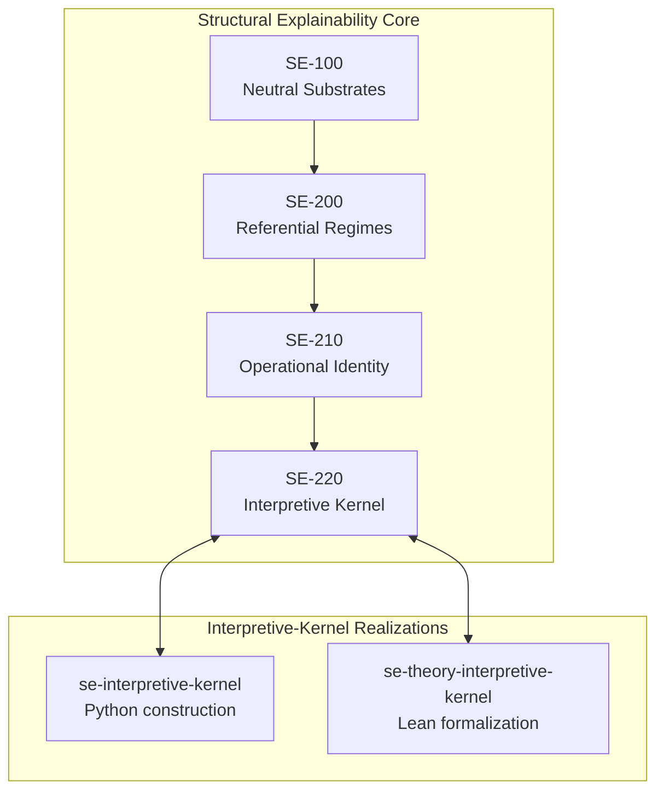

# Structural Explainability

<!-- markdownlint-disable MD024 -->

[](https://opensource.org/license/MIT)

[](https://github.com/structural-explainability/.github/actions/workflows/links.yml)

> Defines the neutral constraints under which systems remain explainable,
> inspectable, and contestable without embedding interpretation.

## Core Statement

Structural Explainability (SE) defines a neutral structural substrate for recording
identity, structure, transformation, and change without embedding interpretation,
authority, causality, or judgment.

Structural Explainability is not anti-interpretation; it is anti-implicit interpretation.
It separates structural facts from downstream claims so interpretation and
disagreement can remain explicit, attributable, and contestable over time.

Record systems commit to identity semantics.
When a rule is refined, an agent redeployed, a jurisdiction subdivided,
or two records merged, the system decides whether the thing is still the same thing.
That decision is load-bearing for citation, liability, and audit, but not always declared.

SE makes the commitment declarable and the failure detectable.

### The Foundational Core

- **Identity & Persistence:** Persistent tracking and provenance depend on
  inspectable identity conditions. Identity is _regime-relative_:
  a single structural change might preserve identity under one regime,
  break it under another, or be identity-neutral under a third.
- **Declared Identity Semantics:** A system may induce a rule of sameness
  through an audited implementation surface based on one registered artifact
  or on a joint mechanism over several registered artifacts.
  SE makes divergence from the declared rule detectable as a finite witness
  and separates detection from sibling diagnosis and regime substitution.
- **Plural Systems:** SE is built for independent architectures
  that share data without requiring a centralized authority,
  uniform naming, or a single forced ontology.

### The Architecture Stack

| Layer                         | Function                                                                                                                                                                       |
| :---------------------------- | :----------------------------------------------------------------------------------------------------------------------------------------------------------------------------- |
| **Neutral Substrate**         | Defines admissible structural description without interpretive commitment.                                                                                                     |
| **Transformation Theory**     | Identifies and defines structural change pressures.                                                                                                                            |
| **Persistence Theory**        | Classifies each transformation, relative to an identity regime, as identity-preserving (PRS), identity-breaking (BRK), identity-neutral (NEU), or inapplicable (NA).           |
| **Identity Regimes**          | Organizes identity and persistence behavior into nine core identity regimes.                                                                                                   |
| **Operational Identity**      | Compares the declared identity partition with operational partitions induced by audited surfaces, exposing divergence as a finite witness.                                     |
| **Interpretive Kernel**       | Transports equivalence requirements between distinct finite carriers connected by interpretation, computing kernels, least coherent output regimes, thresholds, and witnesses. |
| **Structural Explainability** | Integrates these layers into an explicit, explainable account without forcing consensus.                                                                                       |

Within the core substrate, structure, transformation, persistence, and regime
behavior may be recorded.
Causal explanation, normative evaluation, authority,
legitimacy, obligation, and enforcement are not asserted as substrate-level commitments;
they may be attached through constrained downstream mechanisms.

Downstream domains (e.g., law, infrastructure, agentic AI systems)
consume the core substrate without redefining it.
SE records the structural commitments of a system without deciding their ultimate meaning,
enabling continuous cross-institutional coordination through persistent disagreement.

## Overview

Some information systems make decisions that affect people, attribute claims to
sources, record contested facts, or coordinate across institutions that disagree.
Those systems can hold a compliance conclusion, a legal holding, or a causal claim
while every party continues to refer to the same underlying artifacts.

They fail in a specific way.
Under change, the system must decide what stays the same:
whether a refined rule is the same rule,
whether a redeployed agent is the same agent,
whether a subdivided scope is the same scope.
The implementation answers through fields, predicates, workflow states,
configuration values, or joint mechanisms over several registered artifacts.
Identity-relevant uses of those mechanisms may induce
an operational identity partition that differs from the declared identity partition.

That divergence may remain invisible until the system is challenged
in court, in audit, in appeal, in public review, or in cross-institutional reconciliation.
By then, the records may already have committed to an identity model not explicitly declared.

Existing infrastructure may not catch it.
Provenance models, content credentials, software bills of materials,
version control, and audit logs record what happened.
They do not necessarily require a system to declare its rule of sameness
or compare that declaration against the
identity relation induced by its implementation.

Six of the nine identity regimes sit in pairs on three sibling axes:
LOC/OBJ, SCOPE-E/SCOPE-S, RULE-C/RULE-S.
Each pair offers two admissible identity bases for the same kind of referent.
When a sibling basis is available and also splits an examined declared class,
the divergence can be classified against it;
otherwise, the divergence is unpositioned.

A divergence has a specific, finite witness:
a pair of records the declared partition places together and an audited surface separates.
That pair is the witness.
The witness alone does not establish the divergence's sibling classification
or which identity basis the surface carries.
A surface implements a hidden identity regime only when
the sibling differs from the declared regime on the examined domain
and the operational partition equals the sibling partition there.

Operational Identity defines what a system must declare for this to be checked,
and gives the procedure.

SE does not replace domain vocabularies, standards, ontologies, or existing data systems.
It constrains how systems implement them so that disagreement remains
visible, attributable, and useful over time.

## Papers

The formal core of Structural Explainability is developed in a series of papers.
These papers are the normative specification of the framework.

| Paper      | Title                                                                                                   | arXiv                                          |
| ---------- | ------------------------------------------------------------------------------------------------------- | ---------------------------------------------- |
| **SE-100** | _Neutral Substrates: A Design Constraint for Shared Records Under Persistent Interpretive Disagreement_ | [2601.14271](https://arxiv.org/abs/2601.14271) |
| **SE-200** | _Referential Regimes: Transformation-Invariant Identity for Neutral Substrates_                         | [2601.16152](https://arxiv.org/abs/2601.16152) |
| **SE-210** | _Operational Identity: A Finite Audit of Declared and Implemented Rules of Sameness_                    | [2607.20729](https://arxiv.org/abs/2607.20729) |
| **SE-220** | _Interpretive Kernel: From Occurrence Equivalence to Frame Equivalence_                                 | _in progress_                                  |

**SE-100** establishes the neutrality-by-design constraint:
a substrate is neutral when its foundational layer is restricted
to referential commitments and permitted attribution propositions.

**SE-200** derives the referential-regime structure that neutral substrates require,
yielding nine core identity regimes:
three unpaired regimes, OBL, OCC, and REC,
and six regimes paired across three sibling axes:
LOC/OBJ, SCOPE-E/SCOPE-S, and RULE-C/RULE-S.

**SE-210** defines the operational identity partition,
the rule of sameness induced by an examined implementation surface,
and a finite audit comparing it against the declared identity partition.
The audit detects divergence, returns finite witnesses, and separates divergence detection from sibling positioning and regime-substitution claims.

**SE-220** studies equivalence relations over distinct interpreted carriers.
A finite probe family and an interpretation function
connect a carrier of environments with a carrier of interpreted outputs.
An output equivalence induces an interpretive kernel over environments.
A declared environment regime that refines that kernel is coherent.

The companion construction also computes the least output equivalence
required to make a declared environment regime coherent.
The resulting adjunction transports equivalence requirements between the two carriers and
returns finite witnesses when a proposed identification is not supported by interpretation.

| Repository                                                                                                                                                | Role                                                                                                                 |
| --------------------------------------------------------------------------------------------------------------------------------------------------------- | -------------------------------------------------------------------------------------------------------------------- |
| [paper-100-neutral-substrate](https://github.com/structural-explainability/paper-100-neutral-substrate)                                                   | Paper source for SE-100: Neutral substrates                                                                          |
| [paper-200-identity-regimes](https://github.com/structural-explainability/paper-200-identity-regimes)                                                     | Paper source for SE-200: Referential regimes                                                                         |
| [paper-210-operational-identity](https://github.com/structural-explainability/paper-210-operational-identity)                                             | Paper source for SE-210: Operational Identity                                                                        |
| [se-verification-operational-identity](https://github.com/structural-explainability/se-verification-operational-identity)                                 | Executable verification of finite mathematical core of SE-210                                                        |
| [se-pilot-identity-preservation-supply-chain-software](https://github.com/structural-explainability/se-pilot-identity-preservation-supply-chain-software) | Feasibility pilot for source-grounded identity-preservation conformance across software supply-chain representations ([overview](https://github.com/structural-explainability/se-pilot-identity-preservation-supply-chain-software/blob/main/generalization/README.md)) |
| [se-verification-vulnerability-matching](https://github.com/structural-explainability/se-verification-vulnerability-matching)                             | Exploratory study of SE-210 security-relevant identity semantics in software vulnerability matching                  |
| [paper-220-interpretive-kernel](https://github.com/structural-explainability/paper-220-interpretive-kernel)                                               | (in-progress) Paper source for SE-220: Interpretive Kernel                                                           |
| [se-interpretive-kernel](https://github.com/structural-explainability/se-interpretive-kernel)                                                             | (in-progress) Domain-agnostic executable construction for kernels, thresholds, and finite witnesses                  |

### Executable Verification

The SE-210 verification repository contains two independent implementations
of the finite operational identity audit defined by the paper.

The literal oracle constructs the relevant relations explicitly
and applies the paper definitions directly.
The optimized checker uses union-find closures, operational-signature grouping, and declared-block comparisons.

The implementations are compared across paper-derived regression cases,
an exhaustive deterministic sweep over small instances, and randomized instances.

The SE-220 implementation work follows a related but distinct structure.
The Python and Lean repositories are independent realizations;
disagreement indicates at least one definition, proof, implementation, or test obligation must be repaired.

- `se-interpretive-kernel` implements the finite partition algebra and kernels and remains domain-agnostic.
- `se-theory-interpretive-kernel` formalizes the same mathematical contract in Lean.

The papers are normative.
Companion repositories test the internal consistency, computability, algorithmic claims, and finite consequences of paper definitions.

### Identity-Preservation Pilot

The `se-pilot-identity-preservation-supply-chain-software` repository tests a
lower-level, source-grounded representation-preservation obligation in
software supply-chain transformations.

Its initial commitment asks whether Package URL (PURL) identity information
survives SPDX-to-CycloneDX transformation in the canonical target location.

The commitment and evaluator were fixed before real-artifact engineering
validation.
Validation against CycloneDX/cyclonedx-cli issue #424 reproduces
the historical relocation defect and distinguishes it from the corrected
behavior across the surrounding release history:

```text
0.29.0   source_parse_failure
0.29.1   VIOLATED_RELOCATED
0.29.2   VIOLATED_RELOCATED
0.30.0   VIOLATED_RELOCATED
0.31.0   VIOLATED_RELOCATED
0.32.0   PRESERVED
0.33.0   PRESERVED
0.33.1   PRESERVED
```

These results are **engineering-validation** evidence,
not held-out generalization evidence.

The pilot is informed by Structural Explainability but does not assume that
every representation-preservation commitment is an SE-210
operational-identity relation.

## Theory

Independent Lean 4 formalizations of the SE layers.
Each is a machine-checked realization of the corresponding normative paper.
All namespaces are under `SE.*`.

| Repository                                                                                                              | Paper / Role                                | Namespace / Provides                                                                        |
| ----------------------------------------------------------------------------------------------------------------------- | ------------------------------------------- | ------------------------------------------------------------------------------------------- |
| [se-theory-neutral-substrate](https://github.com/structural-explainability/se-theory-neutral-substrate)                 | SE-100 Neutral Substrate                    | SE.NeutralSubstrate: primitives, frameworks, admissibility; neutrality adequacy proof       |
| [se-theory-transformation](https://github.com/structural-explainability/se-theory-transformation)                       | SE-200 Transformation Theory                | SE.Transformation: transformation kinds, families, and operators (change-pressure taxonomy) |
| [se-theory-persistence](https://github.com/structural-explainability/se-theory-persistence)                             | SE-200 Persistence Theory _(in progress)_   | SE.Persistence: PRS / BRK / NEU / NA classification of a transformation under a regime      |
| [se-theory-identity-regimes](https://github.com/structural-explainability/se-theory-identity-regimes)                   | SE-200 Identity Regimes                     | SE.IdentityRegimes: nine core regimes, three sibling axes, split-pressure profiles          |
| [se-theory-operational-identity](https://github.com/structural-explainability/se-theory-operational-identity)           | SE-210 Operational Identity _(in progress)_ | SE.OperationalIdentity                                                                      |
| [se-theory-interpretive-kernel](https://github.com/structural-explainability/se-theory-interpretive-kernel)             | SE-220 Interpretive Kernel _(in progress)_  | SE.InterpretiveKernel                                                                       |
| [se-theory-structural-explainability](https://github.com/structural-explainability/se-theory-structural-explainability) | Integration                                 | SE.StructuralExplainability: composes the layers into one explainable account               |

## Domain Testing

## Domain Testing

| Repository                                                                                                                                                | Responsibility                                                |
| --------------------------------------------------------------------------------------------------------------------------------------------------------- | ------------------------------------------------------------- |
| [se-pilot-identity-preservation-supply-chain-software](https://github.com/structural-explainability/se-pilot-identity-preservation-supply-chain-software) | Software supply-chain identity-preservation feasibility pilot |
| [se-verification-vulnerability-matching](https://github.com/structural-explainability/se-verification-vulnerability-matching)                             | Exploratory software vulnerability-matching study             |
| [se-df](https://github.com/structural-explainability/se-df)                                                                                               | (in-progress) Domain-agnostic machinery                       |
| [substrate](https://github.com/structural-explainability/scheduling-semantic-substrate)                                                                   | (in-progress) Domain testing                                  |
| [conformance](https://github.com/structural-explainability/schedule-conformance)                                                                          | (in-progress) Conformance                                     |

## Repository Manifests

SE repositories use manifests to describe the repository's role, scope, dependencies,
provided artifacts, validation expectations, governance, and traceability.

The SE manifest complements external metadata standards.
Citation metadata belongs in `CITATION.cff`;
software supply-chain metadata may use SPDX;
software discovery metadata may use CodeMeta;
research-object packaging may use RO-Crate.

| Repository                                                                            | Purpose                                        |
| ------------------------------------------------------------------------------------- | ---------------------------------------------- |
| [se-manifest-schema](https://github.com/structural-explainability/se-manifest-schema) | Canonical manifest schema for SE repositories. |

## Dependency Chain


```mermaid
flowchart TD
  subgraph SE["Structural Explainability Core"]
    NS["SE-100<br/>Neutral Substrates"]
    RR["SE-200<br/>Referential Regimes"]
    OI["SE-210<br/>Operational Identity"]
    IK["SE-220<br/>Interpretive Kernel"]

    NS --> RR
    RR --> OI
    OI --> IK
  end

  subgraph IKR["Interpretive-Kernel Realizations"]
    IKPY["se-interpretive-kernel<br/>Python construction"]
    IKLEAN["se-theory-interpretive-kernel<br/>Lean formalization"]

    IK <--> IKPY
    IK <--> IKLEAN
  end
```

## How to Use This Organization

- **To understand the theory**, read the three papers.
- **To compare a record system's declared and implemented rules of sameness**, apply the Operational Identity audit from SE-210.
- **To see source-grounded identity-preservation conformance tested on real software supply-chain artifacts**, see
  [se-pilot-identity-preservation-supply-chain-software](https://github.com/structural-explainability/se-pilot-identity-preservation-supply-chain-software).

<!-- markdownlint-enable MD024 -->
